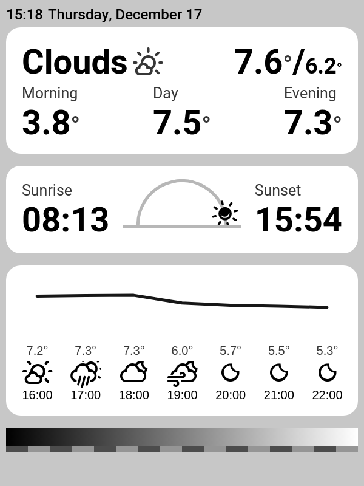
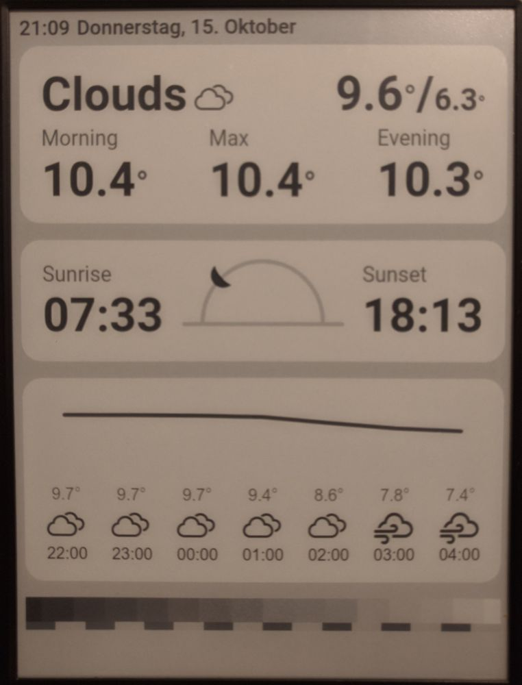

# E-Ink weather

This is a small html snippet that allows you to generate a weather dashboard to be displayed on an e-ink reader.

## E-Ink reader

* I'm currently using it with a dying Kindle 4
    * it has do be [jailbroken](https://wiki.mobileread.com/wiki/Kindle4NTHacking#Jailbreak)
    * it runs [online-screensaver](https://www.mobileread.com/forums/showthread.php?t=236104) to load an image from a server I control

## Configuration

* This project requires the following environment variables to be set:
    * `LAT` - a latitude
    * `LON` - a longitude
    * `OPENWEATHER_KEY` - a valid [OpenWeather](https://openweathermap.org/api) api key

## Installation

* ensure [GraphicsMagick](http://www.graphicsmagick.org/) is installed 
    * This is required to convert the screenshot to black and white
* install dependencies `yarn install`
* start a http server (e.g. `python3 -m http.server 9999`)
* run `node scrot.js` to take a screenshot of the html page
* upload the generated screenshot to the server that is loaded by online-screensaver

## Screenshots

| Name  | Screenshot |
| ------------- | ------------- |
| Rendered output  |   |
| Displayed on a kindle  |   |
